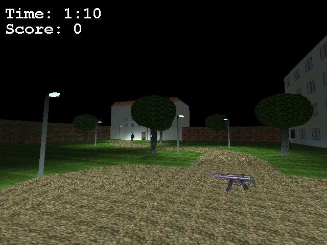



## a 3d ego\-shooter with excellent graphics \(TOP 10 in the All Time Hall of Fame\) \!\!\!

### Description

Hot!!! A completly 3d ego-shooter with excellent graphics, named Shot It! This is version 1.4 with sounds! You can move with the keyboard and look around with the mouse, like in Quake 3 Arena. You can collect a MG and fire with the left mouse button. You can't walk through trees and walls. A bot is also walking through the landscape. Try to frag it as often as possible to get very much points. A highscore is also included. The game is programmed with DirectX 7. CHECK OUT THE SCREENSHOT NOW!

Known bug: If you play this game in combination with Win2000 and DirectX 8, the textures are looking very strange. So, play the game in another PC configuration!
 
### More Info
 

             |
---                |---
**Submitted On**   |2001-07-06 12:58:00
**By**             |[Mathias Kunter](https://github.com/Planet-Source-Code/PSCIndex/blob/master/ByAuthor/mathias-kunter.md)
**Level**          |Advanced
**User Rating**    |4.9 (922 globes from 188 users)
**Compatibility**  |VB 6\.0
**Category**       |[Games](https://github.com/Planet-Source-Code/PSCIndex/blob/master/ByCategory/games__1-38.md)
**World**          |[Visual Basic](https://github.com/Planet-Source-Code/PSCIndex/blob/master/ByWorld/visual-basic.md)
**Archive File**   |[Shot It So22333762001\_4 So\.zip](https://github.com/Planet-Source-Code/mathias-kunter-a-3d-ego-shooter-with-excellent-graphics-top-10-in-the-all-time-hall-of-fam__1-24359/archive/master.zip)

